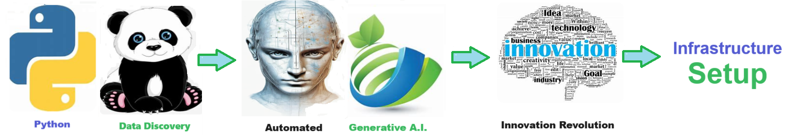

    
# Infrastructure Setup 

## infrastructure_setup

    
## Streamlining Data Management with an Infrastructure Setup Solution

**NEVER LOSE YOUR HARD WORK AGAIN !!!** 

Effective data management is crucial for both **individual productivity** and **team collaboration**.

An **infrastructure setup solution** provides a **consistent directory structure** to organize and house all existing data files, ensuring that no valuable work ever gets lost again.

Designed to work seamlessly both **locally** and **in the cloud**, this solution offers flexibility and **control**, **empowring users** to maintain privacy while facilitating team collaborations.

## Who Can Use Infrastructure Setup Solutions?
1. **Individual Users:** Freelancers, researchers, and students can use this solution to organize their data files, ensuring easy access and secure storage of their work.
2. **Teams and Organizations**: Businesses and project teams can leverage this solution to collaborate efficiently by sharing organized data structures, maintaining data integrity, and avoiding duplication of efforts.
3. **IT Departments:** IT professionals can implement this solution to ensure that corporate data is consistently organized and easily accessible, supporting both local and cloud environments.

## Advantages of Using Infrastructure Setup Solutions
1. **Time Savings**: Automating the setup of a consistent directory structure saves time spent on manually organizing files. Users can quickly find and access the data they need, enhancing productivity.
2. **Improved Collaboration:** With a standardized directory structure, team members can easily share and collaborate on data files, reducing confusion and ensuring that everyone works with the most up-to-date information.
3. **Enhanced Data Security:** The solution allows users to control what gets organized, saved, and shared, ensuring that sensitive data remains private while enabling secure collaboration.
4. **Prevention of Data Loss:**  By systematically organizing data, the solution ensures that no valuable work is lost, providing peace of mind and reducing the risk of data mismanagement.

## Return on Investment (ROI)
The implementation of an infrastructure setup solution can lead to significant **ROI** for both individuals and organizations. By automating data organization and enhancing collaboration, this solution reduces the time and effort required for manual file management. Additionally, the prevention of data loss and improved data security contribute to overall cost savings and increased productivity.
Organization and backup that used to take days now takes only seconds. 

## Conclusion
In conclusion, an **infrastructure setup solution** is a vital tool for efficient data management. It benefits a wide range of users by ensuring organized, secure, and accessible data, ultimately leading to significant time savings and improved collaboration.
 

## Getting Started

The goal of this solution is to **Jump Start** your development and have you up and running in 30 minutes. 

To get started with the **Infrastructure Setup** solution repository, follow these steps:
1. Clone the repository to your local machine.
2. Install the required dependencies listed at the top of the notebook.
3. Explore the example code provided in the repository and experiment.
4. Run the notebook and make it your own - **EASY !**
    
## Code Features

These features are designed to provide everything you need for **Infrastructure Setup** 

- **Self Documenting** - Automatically identifes major steps in notebook 
- **Self Testing** - Unit Testing for each function
- **Easily Configurable** - Easily modify with **config.INI** - keyname value pairs
- **Includes Talking Code** - The code explains itself 
- **Self Logging** - Enhanced python standard logging   
- **Self Debugging** - Enhanced python standard debugging
- **Low Code** - or - No Code  - Most solutions are under 50 lines of code
- **Educational** - Includes educational dialogue and background material

    
## List of Figures
       
    

## Github https://github.com/JoeEberle/ - Email  josepheberle@outlook.com 
    

    